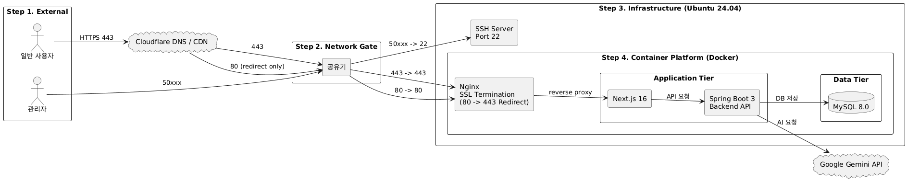

# 프로젝트 개요

읽어드림은 복잡한 법률 용어로 가득한 계약서 앞에서 막막함을 사람들을 위한 **AI 기반 계약서 분석 서비스**입니다.
사용자를 대신해 계약서를 분석하고, 불리한 조항들을 찾아내어 조언을 해줄 수 있는 서비스입니다.

# 프로젝트 목표

계약서 사진 업로드를 시작으로, **사진 업로드** → **AI 분석** → **결과 및 조언** → **카카오톡 공유**로 이어지는 기능을 단계별로 구현합니다.
외부 클라우드에 의존하지 않고 Ubuntu와 Docker를 활용해 직접 홈 서버를 구축하여 서버 아키텍처와 네트워크 흐름을 완벽하게 이해하는 것을 목표로 합니다.

## 핵심 기능 (구현 : ✅)

| **기능**      | **설명**                                        |
|-------------|-----------------------------------------------|
| 이미지 업로드     | 사진을 찍거나 갤러리에서 계약서 이미지를 선택해 서버로 보낸다.           |
| AI 분석 및 요약  | Google AI API를 통해 복잡한 문구를 핵심 내용과 주의사항으로 요약한다. |
| 분석 결과 및 리포트 | 분석된 내용을 사용자가 화면에서 즉시 읽을 수 있게 보여준다.            |
| 카카오 톡 공유    | 카카오톡 메시지 템플릿을 통해 지인에게 즉시 전송한다.                |

## 확장 기능 (구현 : )

| **기능**          | **설명**                                           |
|-----------------|--------------------------------------------------|
| 결과 기록 및 히스토리 관리 | 분석된 데이터를 DB에 저장하여, 사용자가 과거 내역을 언제든 다시 조회하고 관리한다. |
| PDF 및 문서 분석     | 사진 이미지뿐만 아니라 PDF 등 다양한 문서 형식을 지원하여 분석 범위를 확장한다.  |
| SSL 보안 및 도메인    | https 암호화 통신을 적용하고 전용 도메인을 연결하여 서비스의 신뢰도를 높인다.   |
| 서버 모니터링         | 홈 서버의 자원 상태와 트래픽을 실시간으로 감시하여 안정적인 운영 환경을 구축한다.   |

## 기술 스택 (Tech Stack) 및 선정 이유

- 편리한 관리 도구 대신 직접 구축한 홈 서버를 선택한 이유는, 서비스가 배포되는 밑바닥부터 흐름을 이해하고 추후에 타 클라우드 서비스를 제 손으로 통제하고 이해하고 싶었습니다.

| 분류         | 기술/도구                    | 선정 이유                                                                                                                                      |
|------------|--------------------------|--------------------------------------------------------------------------------------------------------------------------------------------|
| 프론트엔드      | Next.js                  | **SEO와 성능을 고려한 실무형 개발**: 단순히 화면을 구현하는 것을 넘어, 서비스 수익화의 핵심인 **검색 엔진 최적화(SEO)** 를 **SSR(서버 사이드 렌더링)** 로 해결하여 실제 유저 유입까지 고려한 설계를 경험하고자 선택했습니다. |
| 백엔드        | Spring Boot              | **엔터프라이즈 표준 기술 습득**: 국내 백엔드 생태계의 표준인 스프링을 통해 객체 지향 설계(OOP) 원칙을 준수하고, 향후 결제 시스템 및 대규모 데이터 확장에 유연하게 대응할 수 있는 견고한 아키텍처를 익히기 위함입니다.            |    
| AI 모델      | Google Gemini API        | **정밀한 법률 분석**: 이미지 내 텍스트 추출(OCR)과 한국어 계약서의 문맥 분석 성능이 뛰어나, 서비스의 핵심 가치인 '정확한 조언' 을 구현하는데 최적입니다.                                              |
| DataBase   | MySQL                    | **데이터 정규화 및 정합성 보장**: 서비스의 핵심인 계약 데이터를 안전하게 관리하기 위해 가장 널리 쓰이는 RDBMS를 선택했습니다. 효율적인 스키마 설계와 쿼리 최적화를 통해 데이터 관리 능력을 증명하고자 합니다.                 |
| OS         | Ubuntu 24.03 LTS, Docker | **Full-Stack 인프라 경험**: 클라우드 추상화 서비스 뒤에 숨겨진 리눅스 커널과 네트워크의 작동 원리를 직접 체득하기 위해 홈 서버를 구축했습니다. 컨테이너 기술로 환경 의존성을 해결하며 배포의 전 과정을 주도적으로 관리합니다.      |
| Web Server | Nginx                    | **실무 환경 모사 및 보안 강화**: 리버스 프록시를 직접 구성하여 서비스(Next.js & Spring)를 분리 운영하고, 포트 포워딩 및 SSL 설정을 통해 실제 상용 서비스와 유사한 네트워크 아키텍처를 설계하는 감각을 길렀습니다.       |

## 시스템 아키텍처



- 모든 외부 트래픽은 Cloudflare 를 거쳐 원본 서버의 IP 노출을 방지하고 보안을 강화합니다.
- 공유기 수준에서 `80`, `443` 포트만 서비스 용으로 개방하고 SSH 관리를 위해서 외부 포트를 통상적으로 사용하는 `22`번 포트가 아닌 `50xxx` 와 같은 커스텀 포트를 매핑하였습니다.
- 사용자의 요청은 프론트 엔드를 거쳐 백엔드로 전송되며, 백엔드는 프론트엔드와 내부적으로 통신합니다.

## 폴더 구조

```
├── read-dream-frontend/  # Next.js 기반 프론트엔드 저장소 
│ ├── src/  # UI 및 클라이언트 사이드 로직
│ └── Dockerfile
├── read-dream-be/  # Spring Boot 멀티 모듈 백엔드 저장소
├── clients/  # 외부 API(Gemini 등) 연동 모듈
├── core/ # 핵심 비즈니스 로직 및 도메인 엔티티
├── storage/  # DB(MySQL) 접근 및 영속성 관리 모듈
├── support/  # 로깅 및 모니터링
├── tests/  # 통합 및 단위 테스트 모듈
└── build.gradle  # 멀티 모듈 통합 빌드 설정
```

## 📋 주요 기능 및 상세 명세 (Features & Specs)

### 1. 계약서 분석

- **[기능]**
    - [x] 사용자가 촬영하거나 업로드한 계약서 이미지를 **AI** 로 분석하여 핵심 조항과 위험 요소를 추출합니다.
- **[예외 상황]**
    - [ ] 업로드 된 이미지의 크기가 20MB를 초과하는 경우
    - [ ] 이미지 파일이 아닌 다른 형식의 파일이 업로드된 경우
    - [ ] 이미지가 너무 흐릿하여 텍스트 추출이 불가능한 경우
    - [ ] AI 모델의 응답 지연이나 API 호출 할당량이 초과된 경우
    - [ ] AI 의 응답이 json 양식에 일치하지 않는 경우
  
