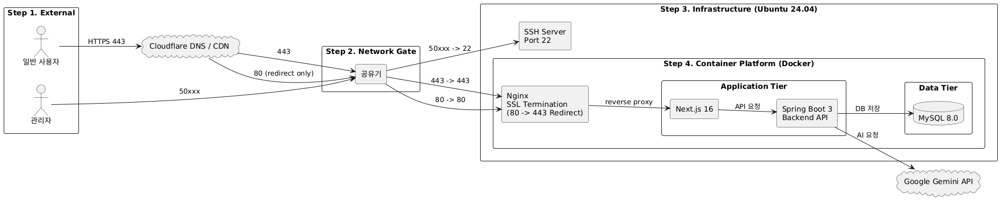

# 프로젝트 개요

읽어드림은 복잡한 법률 용어로 가득한 계약서 앞에서 막막함을 사람들을 위한 **AI 기반 계약서 분석 서비스**입니다.
사용자를 대신해 계약서를 분석하고, 불리한 조항들을 찾아내어 조언을 해줄 수 있는 서비스입니다.

# 프로젝트 목표

계약서 사진 업로드를 시작으로, **사진 업로드** → **AI 분석** → **결과 및 조언** → **카카오톡 공유**로 이어지는 기능을 단계별로 구현합니다.
외부 클라우드에 의존하지 않고 Ubuntu와 Docker를 활용해 직접 홈 서버를 구축하여 서버 아키텍처와 네트워크 흐름을 완벽하게 이해하는 것을 목표로 합니다.

## 핵심 기능 (구현 : ✅)

| **기능**      | **설명**                                        |
|-------------|-----------------------------------------------|
| 이미지 업로드     | 사진을 찍거나 갤러리에서 계약서 이미지를 선택해 서버로 보낸다.           |
| AI 분석 및 요약  | Google AI API를 통해 복잡한 문구를 핵심 내용과 주의사항으로 요약한다. |
| 분석 결과 및 리포트 | 분석된 내용을 사용자가 화면에서 즉시 읽을 수 있게 보여준다.            |
| 카카오 톡 공유    | 카카오톡 메시지 템플릿을 통해 지인에게 즉시 전송한다.                |

## 시스템 아키텍처



- 모든 외부 트래픽은 Cloudflare 를 거쳐 원본 서버의 IP 노출을 방지하고 보안을 강화합니다.
- 공유기 수준에서 `80`, `443` 포트만 서비스 용으로 개방하고 SSH 관리를 위해서 외부 포트를 통상적으로 사용하는 `22`번 포트가 아닌 `50xxx` 와 같은 커스텀 포트를 매핑하였습니다.
- 사용자의 요청은 프론트 엔드를 거쳐 백엔드로 전송되며, 백엔드는 프론트엔드와 내부적으로 통신합니다.

## 폴더 구조

```
├── read-dream-be/  # Spring Boot 멀티 모듈 백엔드 저장소
  ├── clients/  # 외부 API(Gemini 등) 연동 모듈
  ├── core/ # 핵심 비즈니스 로직 및 도메인 엔티티
  ├── storage/  # DB(MySQL) 접근 및 영속성 관리 모듈
  ├── support/  # 로깅 및 모니터링
  ├── tests/  # 통합 및 단위 테스트 모듈
  └── build.gradle  # 멀티 모듈 통합 빌드 설정
```


